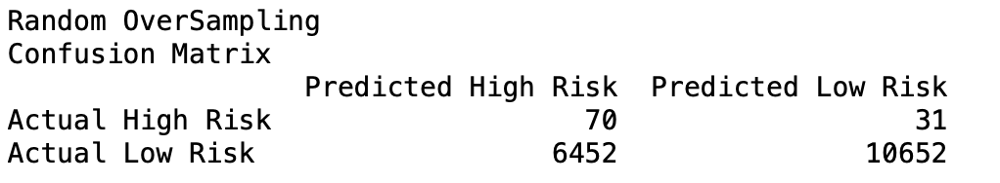
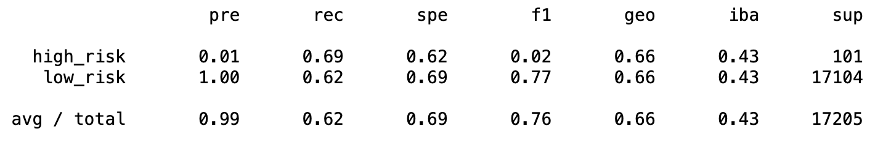
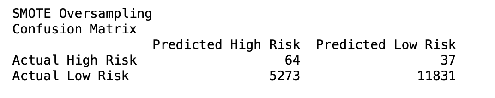
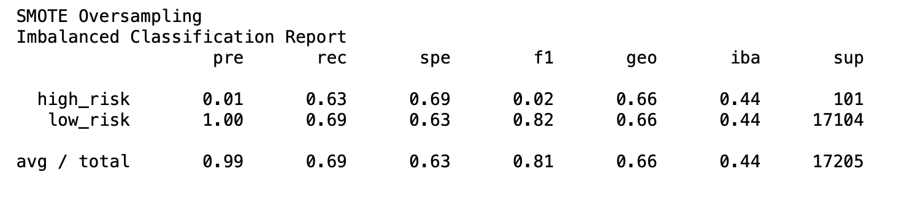
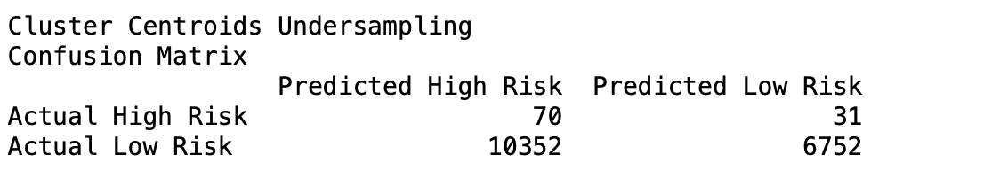
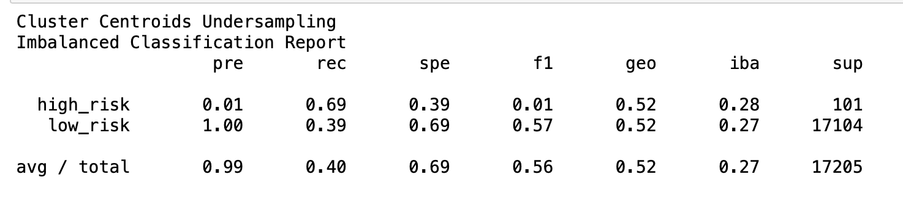
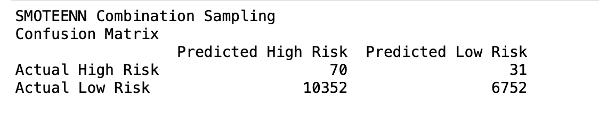
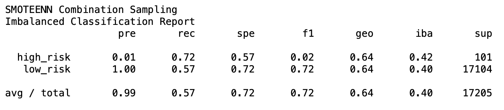
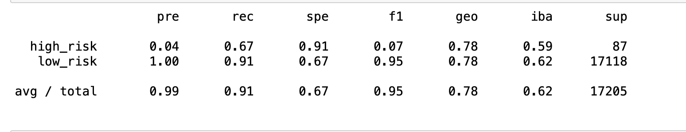
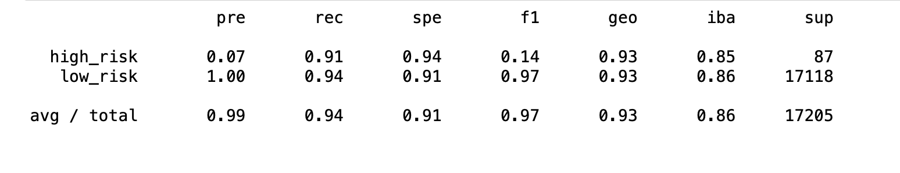

# Overview
On this challenge, I was given the responsibility of looking into unbalanced classification problem with risky loans. 
Using imbalanced-learn and scikit-learn libraries to build and evaluate models using resampling have been part of this work. 

Using the credit card credit dataset from LendingClub, a peer-to-peer lending services company, I have oversampled the data using the RandomOverSampler and SMOTE algorithms, and undersample the data using the ClusterCentroids algorithm and compare two new machine learning models that reduce bias, BalancedRandomForestClassifier and EasyEnsembleClassifier, to predict credit risk. 

## Results
Here are the results generated by different machine learning model predictions of high risk loan application.

### Random oversampling balance accuracy score is 0.66. Below is the confusion matrix.
Simple random sampling is a method used to select a smaller sample size from a larger population and use it to investigate and generalize to a larger group. … the advantages of a simple random sample include its ease of use and an accurate representation of a larger population.

Similarly, how is random sampling done? Random sampling is a type of probability sampling in which a researcher randomly selects a subset of participants from a population. Each member of the population has the same chance of being selected. Data is then collected from the largest possible percentage of this random subset.
 https://dowclub.net/how-is-random-sampling-used/

## Classification Report

### SMOTE Oversampling Confusion Matrix

## SMOTE Oversampling Imbalanced Classification Report (Synthetic Minority Oversampling Technique)

SMOTE is an oversampling technique where the synthetic samples are generated for the minority class. This algorithm helps to overcome the overfitting problem posed by random oversampling. It focuses on the feature space to generate new instances with the help of interpolation between the positive instances that lie together. 

https://www.analyticsvidhya.com/blog/2020/10/overcoming-class-imbalance-using-smote-techniques/

## Cluster centroids 
This a method that replaces cluster of samples by the cluster centroid of a K-means algorithm, where the number of clusters is set by the level of undersampling. 

https://medium.com/subex-ai-labs/class-imbalance-treatment-using-undersampling-50be6a2855a3

### Classification Imbalance Report

## SMOTEENN Combination Sampling
Over-sampling using SMOTE and cleaning using ENN. 
Combine over- and under-sampling using SMOTE and Edited Nearest Neighbours.

https://imbalanced-learn.org/dev/references/generated/imblearn.combine.SMOTEENN.html

## SMOTEENN Combination Sampling Report

## Random Forest Classifier

## Easy Emsemble Classifier

## Summary
I have made the best use of data in hand and the available machine learning models. In all the algoriths above, F1 score has been high.  
F-measure is an evaluation metric for a classification defined as the harmonic mean of precision and recall. The value of F-measure(F1-score) reaches the best value at 1 and the worst value at 0. F1-score 1 represents the perfect accuracy and recall of the model.  
Further studies and research might be needed for more information.